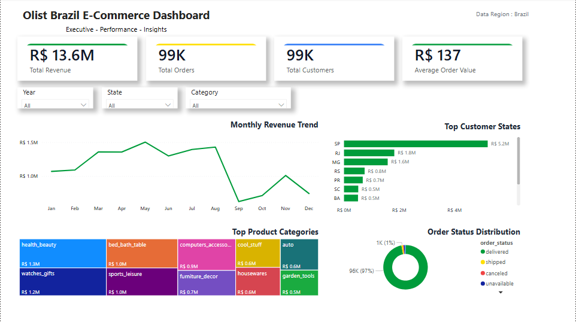

InsightCart | End-to-End E-Commerce Analytics

Project Overview

InsightCart is an end-to-end data analytics project built using the Brazilian E-Commerce (Olist) dataset.

This project transforms raw transactional data into business insights through data cleaning, SQL analysis, DAX metrics, and interactive Power BI dashboards.

---

Business Objective

The objective of this project is to:

- Analyze sales performance
- Understand customer behavior
- Track order trends
- Evaluate product category performance
- Measure delivery performance
- Generate actionable business insights

---

Dataset

Dataset Source:
Kaggle — Brazilian E-Commerce Public Dataset by Olist

Tables Used:

- Customers
- Orders
- Order Items
- Products

---

Tech Stack

- Python (Pandas)
- Jupyter Notebook
- SQL (MySQL)
- Power BI
- DAX
- Git & GitHub

---

Project Workflow

Raw Dataset
↓
Data Cleaning (Python – Pandas)
↓
Processed Dataset Creation
↓
SQL Business Analysis
↓
Power BI Dashboard Development
↓
Business Insights

---

Data Preparation

Performed data cleaning and preprocessing using Pandas:

- Loaded raw datasets
- Handled missing values
- Standardized formats
- Created processed datasets
- Prepared data for analytics

Power BI Transformation:

- Merged Portuguese product categories with English category names
- Created relationships across tables
- Built interactive filtering

---

SQL Analysis

Performed business analysis using SQL:

1. Month-on-Month Revenue & Delivered Orders Trend

2. Top 5 Revenue Generating States

3. Top Product Categories by Revenue & Sales

4. Product Categories with Highest Canceled Orders

5. Average Order Value (AOV) by State

6. Average Delivery Time by State

---

DAX Measures

Created measures including:

- Total Revenue
- Total Orders
- Total Customers
- Average Order Value (AOV)
- Average Delivery Days
- Late Deliveries
- On-Time Delivery Percentage

---

Dashboard Features

- KPI Cards
- Revenue Trend Analysis
- Customer State Analysis
- Product Category Analysis
- Dynamic Cross Filtering
- Interactive Dashboard Experience

---

Project Structure

InsightCart/

├── dashboard/

├── data/
│ ├── raw/
│ └── processed/

├── dax_measures/

├── notebooks/

├── scripts/

├── sql_queries/

├── dashboard_preview.png

├── README.md

└── requirements.txt

---

## Dashboard Preview

Key Insights

- Revenue performance changes over time
- Customer activity varies by state
- Product categories contribute differently to business growth
- Delivery time impacts customer experience

---

Author

Abhishek Pardeshi
